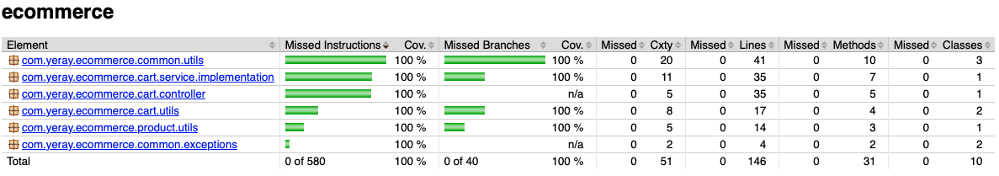
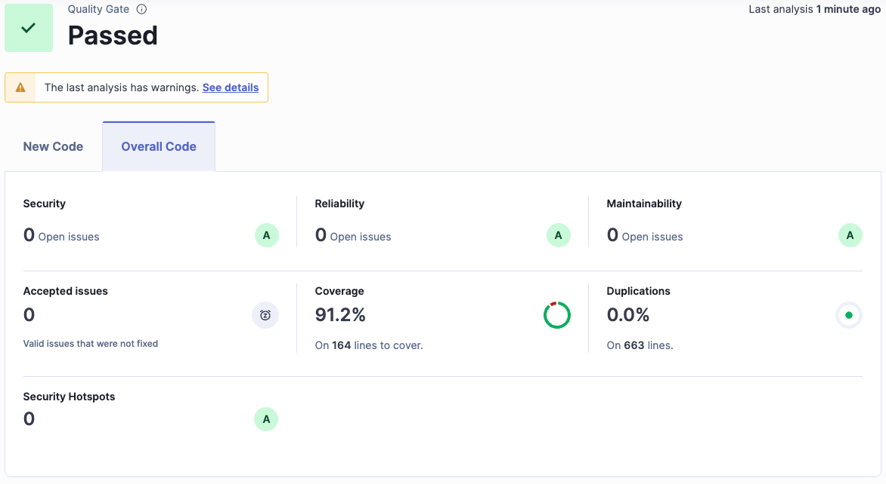

# 🛒 E-Commerce API - Backend Technical Assignment

Este proyecto es una solución a una prueba técnica para una API de e-commerce desarrollada con Java y Spring Boot. Se ha optado por una arquitectura modular, escalable y fácilmente mantenible.

---

## 📦 Tecnologías utilizadas

- Java 17
- Spring Boot v3.2.0
- Maven v3.9.9
- Swagger OpenAPI (endpoints documentados -> http://localhost:8080/swagger-ui/index.html)
- JUnit
- Mockito
- Jacoco (cobertura de tests)
- Lombok
- SonarQube (análisis de código)

---

## 🧠 Arquitectura

La estructura del proyecto está organizada **por unidades de negocio** (entidades), lo que permite una escalabilidad clara. Cada entidad contiene su propia organización interna siguiendo principios SOLID.
Esto permite:

- Una separación clara de responsabilidades.
- Implementaciones fácilmente testeables.
- Escalabilidad del proyecto para añadir nuevas funcionalidades o entidades sin afectar las existentes.
- Un diseño mantenible y orientado a futuro.

### Importante:
Dado que el enunciado especifica que no se debe usar un gestor de base de datos, y que estos deben ser volátiles sin preocuparse por restarts, se ha optado por una implementación en memoria utilizando una lista para simular la persistencia de datos. 
En caso de necesitar dicha implementación, la arquitectura incluiría un directorio /repository/ a nivel de cada unidad de negocio. Es decir, si se quisiera implementar una base de datos para la entidad `Product`, se crearía un directorio `product/repository/` que contendría la lógica de acceso a datos. 
El hecho de no haberlo incluido en esta prueba técnica ha sido una decisión basada en la facilitar los reportes de cobertura de tests y análisis de código en SonarQube.
---
## Análisis de calidad
Los reportes de SonarQube y Jacoco se han generado para evaluar la calidad del código y la cobertura de tests.
Los reportes de Jacoco se encuentran en la carpeta `target/site/jacoco/index.html`. 
Para SonarQube, se ha configurado un servidor local que analiza el proyecto. 
### 🔍 Cobertura de Tests

### SonarQube

---
