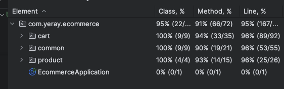

# 🛒 E-Commerce API - Backend Technical Assignment

Este proyecto es una solución a una prueba técnica para una API de e-commerce desarrollada con Java y Spring Boot. Se ha optado por una arquitectura modular, escalable y fácilmente mantenible.

---

## 📦 Tecnologías utilizadas

- Java 21
- Spring Boot v3.2.0
- Maven v3.9.9
- Swagger OpenAPI (endpoints documentados -> http://localhost:8080/swagger-ui/index.html)
- JUnit
- Mockito

---

## 🧠 Arquitectura

La estructura del proyecto está organizada **por unidades de negocio** (entidades), lo que permite una escalabilidad clara. Cada entidad contiene su propia organización interna siguiendo principios SOLID.
Esto permite:

- Una separación clara de responsabilidades.
- Implementaciones fácilmente testeables.
- Escalabilidad del proyecto para añadir nuevas funcionalidades o entidades sin afectar las existentes.
- Un diseño mantenible y orientado a futuro.

---

## 🔍 Cobertura de Tests

---
